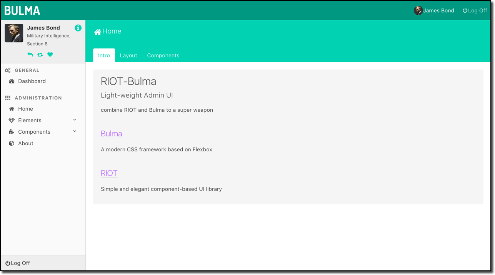

# riot-bulma

combine RIOT and Bulma

DEMO: [https://riot-bulma.github.io/](https://riot-bulma.github.io/)



## Bulma

A modern CSS framework based on Flexbox

[Bulma](http://bulma.io/)

## RIOT

Simple and elegant component-based UI library

[RIOT](http://riotjs.com)

## dependencies

```sh
riot
Bulma
koa
webpack
ECharts
NProgress
https://github.com/Joylei/koa-webpack-middleware.git
```

## known issues

- from riot@3.0.0, you have to import riot like:

```js
import * as riot from 'riot'
```

which may make your existing code not work

- 'show/hide' has different scope from 'if' directive, see src/app/tags/pages/page-home.html

riot@3.0.5

- VIRTUAL tag is not virtual and still has a virtual element left on dom.

see https://jsfiddle.net/wgs22gkg/2/
riot@3.0.5

- 'show' not work as expected
see src/app/tags/components/collapse/collapse-item.html
riot@3.0.5

## License

MIT

## thanks

[Vue-Bulma](https://github.com/wangxg2016/vue-bulma)